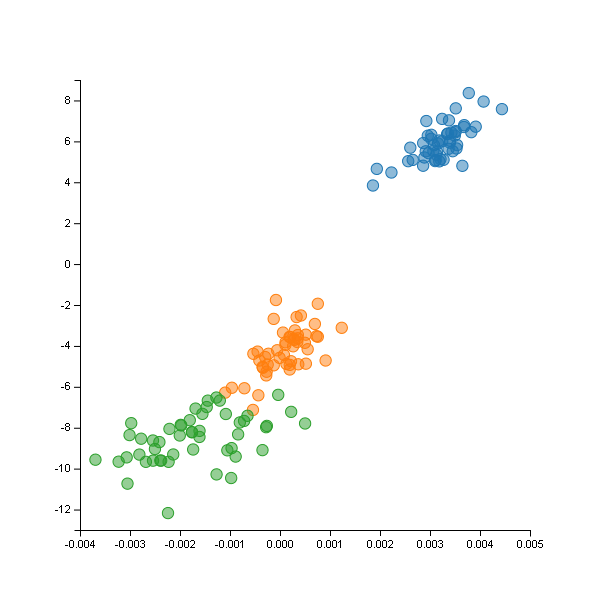
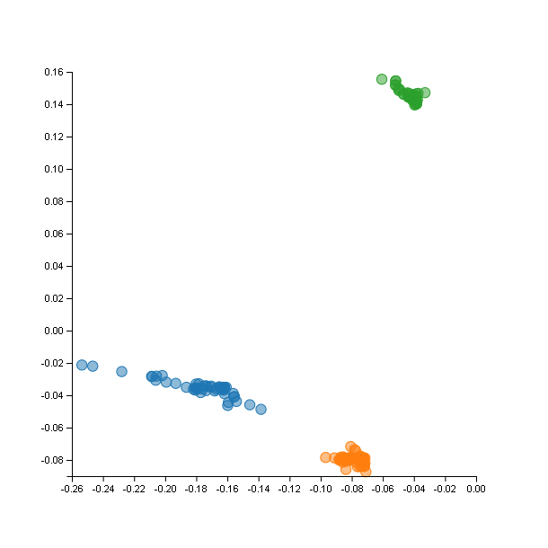

# LDA

## Overview

This package implements Linear Discriminant Analysis with Fisher's dicriminant and Kernel Linear Discriminant Analysis
with the following kernels:
* Linear
* Polynomial
* Laplacian RBF
* RBF

## Installation

```julia
Pkg.clone("https://github.com/remusao/LDA.jl.git")
Pkg.update()
```

## Usage

```julia
using Vega
using LDA
using RDatasets

# Try with Iris
iris = data("datasets", "iris")

# Create data matrix
data = matrix(iris[:, 2:5])'

# Create labels vector
labels = Array(Int, size(data, 2))
for i = 1:size(data, 2)
    x = iris[:, 6][i]
    if x == "setosa"
        labels[i] = 1
    elseif x == "virginica"
        labels[i] = 2
    else
        labels[i] = 3
    end
end

# lineaire
rbf_res = lda(data, labels, 3, linear)
println("Printing results")
print_2Ddecision(rbf_res, data, labels)


# RBF 0.4
rbf_res = lda(data, labels, 3, rbf, 0.4)
println("Printing results")
print_2Ddecision(rbf_res, data, labels)
```




