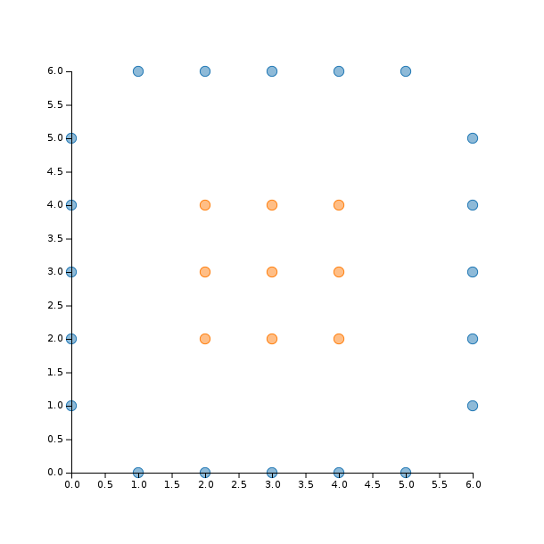
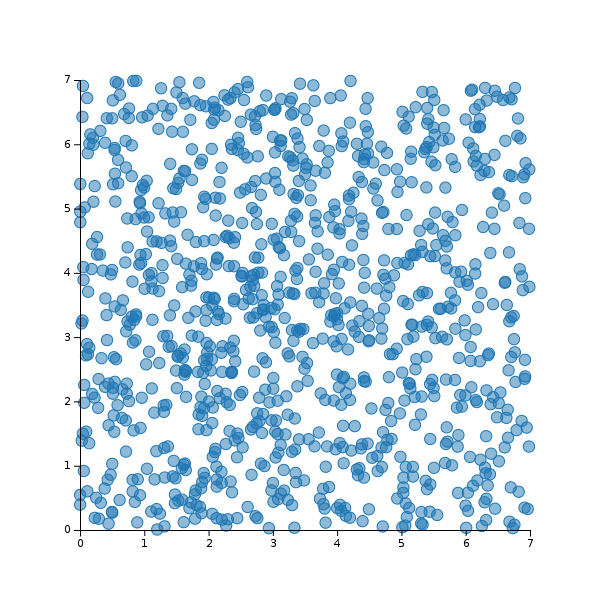
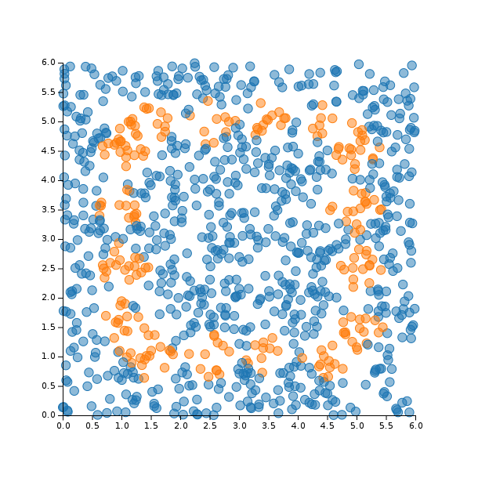

# LDA

## Overview


## Installation

```julia
Pkg.clone("https://github.com/remusao/LDA.jl.git")
Pkg.update()
```

## Usage

```
using Vega
using LDA

# Declare data
x = [[0 0 0 0 0 1 1 2 2 2 2 2 3 3 3 3 3 4 4 4 4 4 5 5 6 6 6 6 6],
     [1 2 3 4 5 0 6 0 2 3 4 6 0 2 3 4 6 0 2 3 4 6 0 6 1 2 3 4 5]]

# Labels (-1 or +1)
y = [-1, -1, -1, -1, -1, -1, -1, -1, 1, 1, 1, -1, -1, 1, 1, 1, -1, -1, 1, 1, 1, -1, -1, -1, -1, -1, -1, -1, -1]

# Random data to test with unknown labels
data = rand(2, 1000) * 7

plot(x = reshape(x[1, :], size(x, 2)), y = reshape(x[2, :], size(x, 2)), group = y, kind = :scatter)
```



```julia
# Try with linear kernel
# This is the classic LDA algorithm
lin = LDA.lda(x, y)
print_2Ddecision(lin, data)
```



```julia
# Try with a RBF kernel and different sigmas
rbf_res = LDA.lda(x, y, rbf, sigma)
print_2Ddecision(res, data)
```


